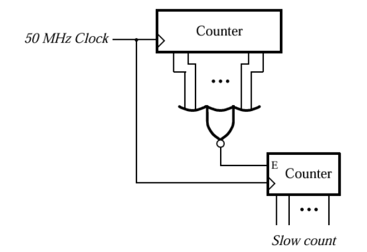

# Gated Counter

As part of the IC Design Training Program, I implemented a Gated Counter (Clock Counter with Enable). In this circuit, there are two counters. The first counter is an 8-bit free running counter which continuously increments from 0 to 255 and wraps around to 0 without any external input. When this counter reaches it's maximum value, it generates a clock tick. This clock tick will act as the clock or rather an enable for the second counter, which will only increment on this tick.

  

I originally implemented the circuit in Verilog but I have added the SystemVerilog implementation as well. Both implementations differ only slightly in syntax but will give the same output and waveform.

## Frequency and Time Period

To count the frequency and time period of both counters, see that in our testbench, we defined our clock oscillations every 5ns.
Then, 5ns (High) + 5ns (Low) = 10ns (Time Period)      
f = 1/ 10ns = 100 MHz

Tick is high for 1 clock cycle/period out of 256 cycles:  
Time between ticks = T_tick = 256 × 10 ns = 2.56 µs    
Frequency = f_tick = 1/2.56 µs = 390.625 kHz

Now, consider the slow_counter module. The value in the slow_counter changes every 2.56 µs but the value itself is 8-bits and upon synthesis, each bit will be a wire of it's own that will be high or low and each wire will have a frequency on how often it changes.

For bit 0 i.e. state[0],  
Time Period = 2 × 2.56μs = 5.12μs   
Frequency = 1/5.12μs = 195.3125 kHz   

For bit 1 i.e. state[1],  
Time Period = 2 × 5.12μs = 10.24μs   
Frequency = 1/10.24μs = 97.65625 kHz    
  
Similarly, for the rest of the bits, we have the following values:   
   
For bit 2 i.e. state[2],    
Time Period = 2 × 10.24μs = 20.48μs   
Frequency = 1/20.48μs = 48.828125 kHz   
    
For bit 3 i.e. state[3],  
Time Period = 2 × 20.48μs = 40.96μs     
Frequency = 1/40.96μs = 24.4140625 kHz    
    
For bit 4 i.e. state[4],   
Time Period = 2 × 40.96μs = 81.92μs   
Frequency = 1/81.92μs = 12.20703125 kHz   
  
For bit 5 i.e. state[5],   
Time Period = 2 × 81.92μs = 163.84μs   
Frequency = 1/163.84μs = 6.103515625 kHz   
  
For bit 6 i.e. state[6],   
Time Period = 2 × 163.84μs = 327.68μs  
Frequency = 1/327.68μs = 3.0517578125 kHz  
   
For bit 7 i.e. state[7],   
Time Period = 2 × 327.68μs = 655.36μs   
Frequency = 1/655.36μs = 1.52587890625 kHz   
       
  
## Waveform
Following is the waveform of the implemented gated counter:

Since, we run our testbench for around 300 clock cycles, so we see only one tick. To see more, you can simply increase the number of clock cycles in the testbench.  

<i>Note: The state here represents the internal state of the gated counter. </i> 

## How to Run the Code
To run the same code, you need have a software like ModelSim QuartusPrime or Vivado. However, for a quick simulation, without installation, you can use EDA Playground to simulate the code using the following instructions:
1) Go to EDA Playground website and make an account
2) Paste your module and testbench code
3) Select Icarus Verilog in "Tools & Simulators"
4) Check the "Open EPWave after run" tickbox
5) See the waveform

